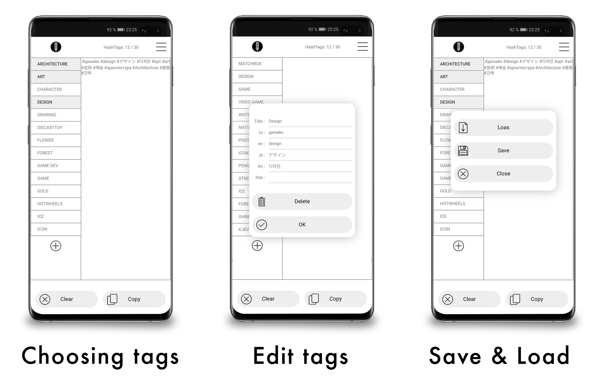

# HT_Dictionary

HT Dictionary will help you quickly select the right tags for your publication immediately in different languages and with additional tags on the topic, which will significantly save time and help turn a large audience into a post or publication on social networks, stores and services with Hashtag support.

The Hashtag dictionary can be downloaded from outside via a json file. It lists a set of tags, supported languages, and additional suitable tags.
The application has a tag counter and a convenient interface for adding and removing tags.

